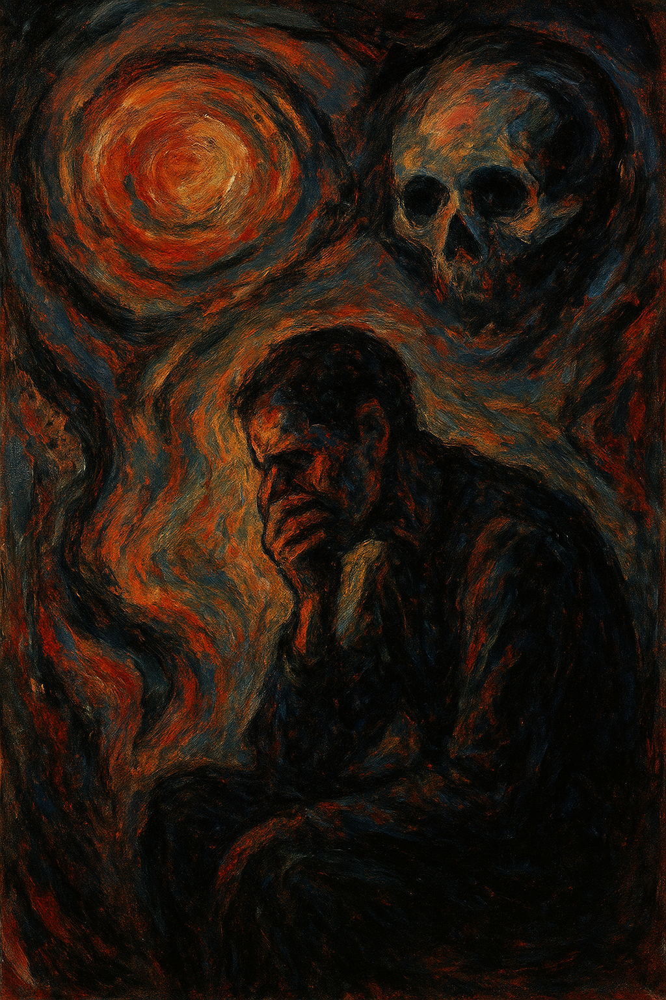

# Symphony No.4 in a minor, Op.63

Sibelius was diagnosed with laryngeal cancer. After undergoing several surgeries, he narrowly succeeded in removing it, but he could not escape the fear of recurrence and metastasis. In the midst of anxiety and despair, he seemed to search for hope through the composition of his [Symphony No. 4](https://youtu.be/HjeF99_ocfM?si=XMe-dd5aPvsbcTfg). This work uses the tritone (augmented fourth), a representative dissonance, as a main harmonic element, which creates a dark and tense atmosphere throughout the piece. In particular, in the introduction of the first movement, the tritone played by the cellos and double basses suggests an unstable tonality, and as it reappears throughout the movements, it gives an impression of physical and psychological imbalance. In the final movement, unlike most symphonies, the tension is not resolved, and instead of a brilliant conclusion, the music fades away with a cold and expressionless tone. The tonal center remains unclear, and the cadence does not close firmly, leaving the sense of unease unresolved. This ending can be interpreted as Sibelius’s musical expression of his inner despair and fear of death, unable to find complete peace. In the end, Symphony No. 4 can be seen as a work that condenses human anxiety, isolation, and unresolved hope in the face of illness and death into a musical language.

Both works reveal the theme of fear and anxiety through sensory expression. In [Sound of Metal](jeon-junwoo.md), the distorted sounds and silence experienced by Ruben after losing his hearing symbolize his fear and confusion. In Sibelius’s Symphony No. 4, the persistent tritone and unresolved harmonies create a tense and unstable atmosphere that reflects the composer’s inner turmoil and fear of death. "Sound of Metal" uses realistic and direct alterations of auditory perception to draw the audience into the protagonist’s sensory world, conveying emotional change with a documentary-like authenticity. In contrast, Sibelius’s Symphony No. 4 employs abstract musical structures and tonal instability to express personal psychological suffering through a symbolic and internalized musical language.

# 교향곡 4번 가단조, 작품번호 63

시벨리우스는 후두암 진단을 받았다. 여러 차례 수술을 하여 가까스로 제거하였으나, 재발과 전이에 대한 두려움을 떨치지 못하고 근심과 공포 속에서 희망을 찾으려는 듯 작곡한 것이 [교향곡 4번](https://youtu.be/HjeF99_ocfM?si=XMe-dd5aPvsbcTfg)이다. 이 작품은 대표적 불협화음인 트라이톤(증4도)을 주 화성으로 사용하는데, 이는 곡 전체에 어둡고 긴장된 분위기를 형성한다. 특히 1악장의 도입부에서 첼로와 콘트라베이스가 연주하는 트라이톤은 불안정한 조성을 암시하며, 이후 전 악장에 걸쳐 반복적으로 나타나면서 마치 신체적, 정신적 불균형을 상징하는 듯한 인상을 준다. 마지막 4악장에서는 보통의 교향곡처럼 긴장감이 해소되거나 화려한 종결부로 나아가지 않고 차갑고 무표정한 음색 속에서 조용히 사라지듯 끝난다. 조성의 중심이 불명확하고, 종지 역시 명확히 닫히지 않아 해소되지 않은 불안이 그대로 남는다. 이러한 결말은 시벨리우스가 죽음의 공포와 내면의 절망 속에서 완전한 안식을 찾지 못한 심리를 음악적으로 드러낸 것으로 볼 수 있다. 결국 교향곡 4번은 병과 죽음에 맞서 싸우는 인간의 불안, 고립, 그리고 미완의 희망을 음악적 언어로 응축한 작품이라 할 수 있다.

‘불안과 공포’가 드러나는 또 다른 작품으로는 영화 [사운드 오브 메탈](jeon-junwoo.md)이 있다. 두 작품 모두 ‘불안과 공포‘라는 인간의 내면적 감정을 감각적으로 드러낸다는 점에서 맞닿아 있다. 영화 사운드 오브 메탈에서는 청력을 잃은 루벤이 경험하는 세상의 왜곡된 소리와 침묵이, 시벨리우스의 교향곡 4번에서는 트라이톤을 중심으로한 불협화음이 각각 두려움과 불안의 정서를 상징한다. 〈사운드 오브 메탈〉은 현실적이고 직접적인 청각 경험의 변형을 통해 관객이 주인공의 감각 속으로 들어가도록 만들며, 감정의 변화를 다큐멘터리적 사실성으로 전달한다. 반면 시벨리우스는 교향곡 4번에서 추상적인 음악적 구조와 조성의 불안정성을 활용해, 개인의 심리적 고통을 상징적이고 내면화된 음악 언어로 표현한다.
