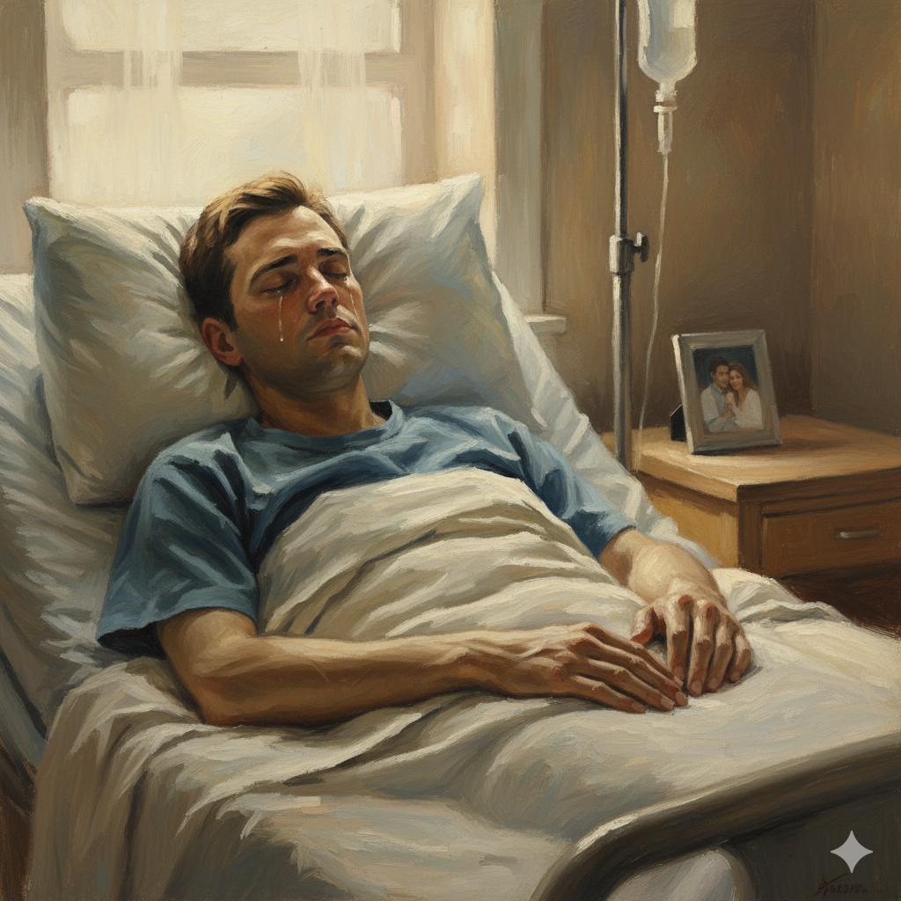

---
Title: Me before you
Year: 2016
Genre: Romantic drama
Disease: General paralysis
ICD: G82.5
--- 

# Me Before You

Will was a successful financier who led an active life before the accident, but after becoming quadriplegic due to a car crash, he loses his will to live and falls into depression. However, through his relationship and communication with his caregiver Louisa, he gradually begins to rediscover the meaning of life. The music used in this film is Ed Sheeran’s [“Photograph"](https://youtu.be/H_z63kWV-80?si=pPBD1DRg_yokUPzy). The lyrics, “We keep this love in a photograph, we made these memories for ourselves,” emphasize the permanence of love, standing in contrast to Will’s decision that his relationship with Louisa cannot continue due to his physical limitations. Within a relationship where physical contact is restricted, the song highlights how emotional connection becomes all the more important. The idea of love that can exist only within a photograph conveys the sincerity of Will’s desire to preserve their love through memory and feeling. This emotional tone allows the audience to deeply empathize with Will’s pain and his enduring love.

The warm, unembellished acoustic sound of <Photograph> evokes the happiest moments by calling them back into the frame of a 'photograph,' conveying Will’s tragic yet beautiful love that can exist only in memories due to his physical limitations. In contrast, the aria [Addio del passato](choi-issac.md) from the opera La Traviata, which represents Violetta’s weakening breath as she approaches death, delicately expresses the lingering emotional resonance left behind with her passing as it reflects on past love through its slow rhythm. Both pieces convey the message that 'the memory of love lasts longer than the body,' emphasizing a spiritual and emotional connection that transcends physical limits.

# 미 비포 유

윌은 사고 전 성공한 금융인이자 활발한 삶을 살던 사람이었지만, 교통사고로 인해 사지마비를 겪으며 삶의 의욕을 잃고 우울감에 빠진다. 그러나 간병인 루이자와의 관계를 통해 서로 소통하며 삶의 의미를 다시 찾아가려한다. 이 작품에 사용된 음악은 Ed Sheeran의 [‘Photograph’](https://youtu.be/H_z63kWV-80?si=pPBD1DRg_yokUPzy)라는 곡이다. “we keep this love in photograph, we made these memories for ourselves”라는 가사는 신체적 제약으로 인해 루이자와의 사랑이 더이상 지속될 수 없다고 느끼는 윌의 결정과 대조적으로 사랑의 영속성을 강조한다. 육체적 접촉이 제한된 관계 속에서 서로의 정서적 교감이 얼마나 중요한지를 보여주며, 사진 속에만 남을 수 밖에 없는 사랑이라는 점에서 기억과 감정을 통해 사랑을 이어가려는 윌의 태도적인 진정성을 더욱 깊게 느낄 수 있다. 이러한 감정선은 관객이 윌의 고통과 사랑에 깊이 공감할 수 있게 해준다. 
<Photograph>의 기교없이 따뜻하고 담백한 어쿠스틱 사운드는 가장 행복했던 때를 '사진'이라는 프레임 속으로 불러오며, 육체적인 제약으로 인해 추억 속에만 머물러야 하는 윌의 비극적이지만 아름다운 사랑을 대변해준다. 반면, 죽음을 앞두고 점점 약해지는 호흡을 형상화한 오페라 ‘라 트라비아타’의 [<지난 날이여 안녕>](choi-issac.md)은 느린 리듬 속에서 과거의 사랑을 회상하며, 비올레타의 죽음과 함께 남게되는 정서적인 여운을 섬세하게 표현해낸다. 두 음악은 모두 '사랑의 기억은 육체보다 오래 남는다.'는 메시지를 전하면서, 육체적인 한계를 넘어서는 정신적,정서적인 교감을 강조하는 음악이라 할 수 있다.
