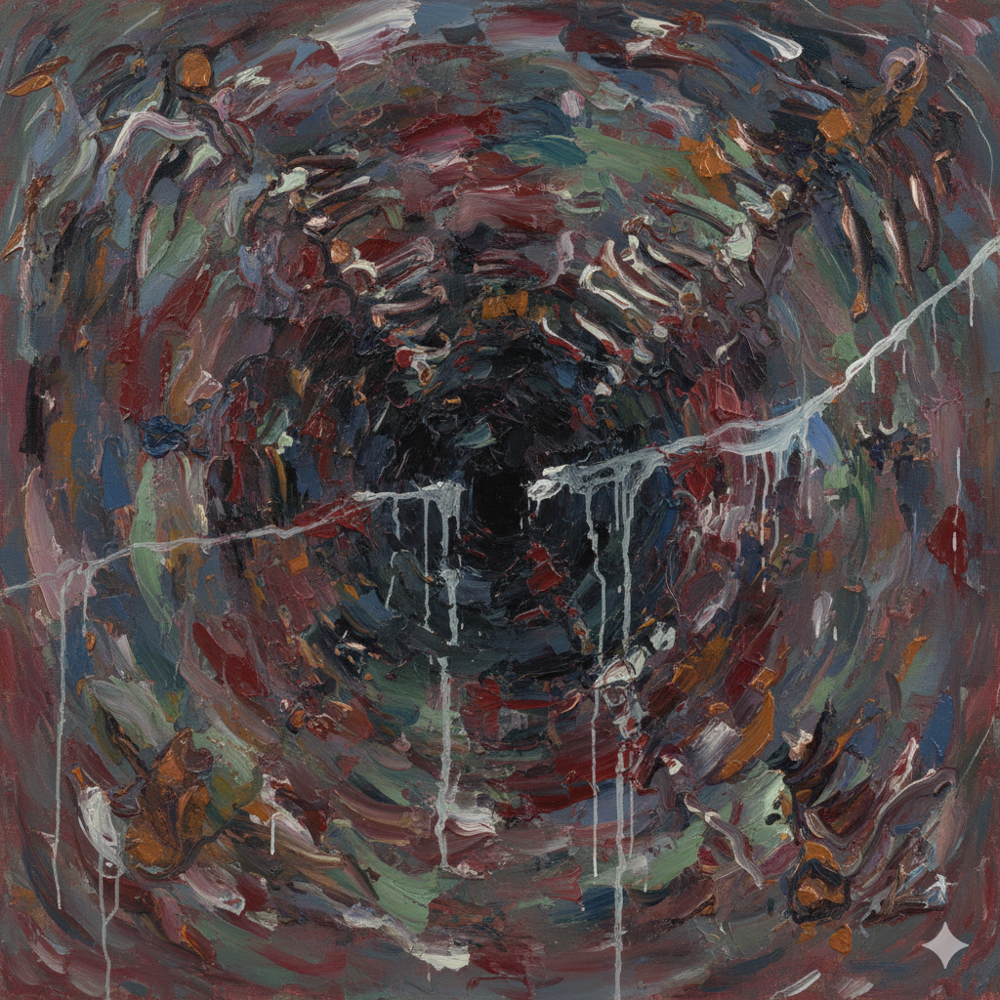

# Philadelphia

In *Philadelphia* (1993), directed by Jonathan Demme, music plays a powerful and emotional role, enhancing the film’s themes of injustice, compassion, and human dignity. The soundtrack uses both diegetic (heard by the characters) and non-diegetic (heard only by the audience) music to create a strong emotional connection to the story of Andrew Beckett (played by Tom Hanks), a lawyer who is fired from his firm because he has AIDS and is gay.

[In one of the film’s most memorable scenes](https://www.youtube.com/watch?v=DwRHwKZSu-w), Andrew plays Maria Callas’s recording of an aria from *Andrea Chénier* (“La mamma morta”) for his lawyer Joe Miller (played by Denzel Washington). As the aria plays, Andrew translates the lyrics about suffering, death, and love, using the music to express feelings he otherwise cannot articulate. This sequence shows music’s ability to transcend words, revealing Andrew’s inner world and evoking Joe’s deeper empathy.

“La mamma morta” from *Andrea Chénier* traverses the boundaries between life and death, love and despair. In the film, Andrew transforms the aria into an act of self-expression—reclaiming a voice silenced by illness and social stigma. The operatic voice becomes his own, turning music into both a language of suffering and a gesture of defiance. In that convergence of vulnerability and transcendence, the listener perceives not merely the tragedy of disease but the enduring dignity of the human spirit.

# 필라델피아 (*Philadelphia*)

조너선 데미(Jonathan Demme)가 감독한 영화 《필라델피아》 (1993)는 음악을 통해 부당함, 연민, 인간 존엄성이라는 주제를 강렬하고 감정적으로 드러낸다. 영화의 사운드트랙은 등장인물이 실제로 듣는 음악(극 내 음악, diegetic)과 관객만이 듣는 음악(극 외 음악, non-diegetic)을 함께 사용하여, 에이즈와 성 정체성으로 인해 해고당한 변호사 앤드루 베킷(톰 행크스 분)의 이야기에 깊은 정서적 몰입을 가능하게 한다.

[영화에서 가장 인상적인 장면 중 하나](https://www.youtube.com/watch?v=DwRHwKZSu-w)는 앤드루가 자신의 변호사 조 밀러(덴절 워싱턴 분)에게 마리아 칼라스의 오페라 《안드레아 셰니에》 중 아리아 「라 마마 모르타(La mamma morta)」를 들려주는 장면이다. 음악이 흐르는 동안 앤드루는 고통, 죽음, 사랑을 노래하는 가사를 번역하며, 말로는 표현할 수 없는 내면의 감정을 음악을 통해 드러낸다. 이 장면은 음악이 언어를 넘어서는 힘을 지니고 있음을 보여주며, 동시에 앤드루의 내면세계를 드러내고 조의 공감을 이끌어낸다.

「라 마마 모르타」는 《안드레아 셰니에》의 비극적 장면 속에서 삶과 죽음, 사랑과 절망의 경계를 탐구하는 곡이다. 영화 속 앤드루는 이 아리아를 통해 질병과 낙인 속에서 침묵을 강요받은 자신을 다시 ‘듣게’ 만든다. 오페라의 목소리가 그의 목소리가 되고, 음악은 고통의 언어이자 저항의 행위로 변한다. 병든 몸의 연약함과 음악의 숭고함이 겹쳐지는 순간, 관객은 질병의 비극을 넘어 인간 존재의 존엄을 듣게 된다.

에이즈를 다루는 또 다른 영화 [코다](kim-yunchae.md)에서는 음악이 다른 방식으로 사용된다. 
