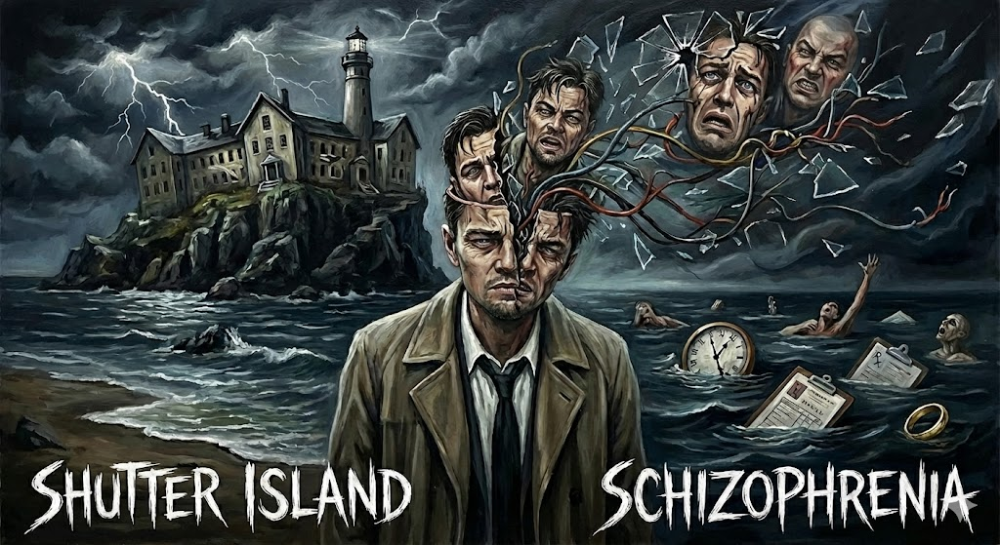

# Shutter Island

Directed by Martin Scorsese and starring Leonardo DiCaprio, Shutter Island is a psychological thriller set in an isolated psychiatric hospital. The film follows U.S. Marshal Teddy Daniels, who, while investigating a disappearance, gradually confronts his own identity and tragic past. He experiences various psychiatric symptoms, including auditory and visual hallucinations and paranoia. His psychological symptoms stem from the suppressed guilt and grief of having lost his wife, who murdered their children before he killed her in a moment of shock. This guilt and sense of loss drive him into paranoia, post-traumatic stress disorder (PTSD), and schizophrenic symptoms in which reality and delusion intertwine, leading him into a chaotic state where the boundaries between the real and the unreal collapse.

[The featured music in the film](https://youtu.be/kQ6PrQP7Y7Q?si=BvUHbroxyHMKFVl6) is Symphony No.3: Passacaglia – Allegro Moderato by Krzysztof Penderecki (1933–2020). The piece is characterized by intense dissonance and repeated low-register string ostinatos, which together create a persistent sense of tension and unease. As an instrumental composition without lyrics, it focuses entirely on its sonic texture to convey emotion, heightening Teddy’s psychological instability and amplifying the suspense surrounding the hidden truths within the psychiatric institution.

The music emphasizes auditory discomfort rather than melodic beauty, immersing the audience into Teddy’s fractured perception. The dissonant layers and relentless tension embody the chaotic sensations of trauma and delusion, allowing the viewers to sonically experience the instability of mental illness. Rather than functioning merely as background music, it acts as a sensory embodiment of the psychological disorder itself.

In another film that explores schizophrenia, [Joker(2019)](yu-jonghun.md), music symbolically portrays how protagonist Arthur Fleck's mental fragmentation is expressed in a violent way, and the process of him breaking away from his existing identity. The piece “Bathroom Dance,” composed by Hildur Guðnadóttir, begins with a low, solitary cello line that gradually builds as additional instruments layer in, creating an increasingly complex structure. This progression mirrors Arthur’s inner shift from isolation and repression to chaos and self-acceptance. In the pivotal bathroom scene, he dances to the music after committing his first crime, shedding the identity of a broken victim of society and being reborn as “the Joker.” The music sonically captures the swirling interplay of anxiety and calm, chaos and serenity, embodying the very moment when his fragmented self fully takes shape.

# 셔터 아일랜드 (Shutter Island)

마틴 스콜세지 감독, 레오나르도 디카프리오 주연의 <셔터 아일랜드>는 외딴 정신병원을 배경으로 한 심리 스릴러 영화이다. 이 영화는 실종 사건을 조사하던 연방 보안관 테디 다니엘스가 점차 자신의 정체와 비극적 과거를 마주하는 과정을 그린다. 그는 환청, 환시, 피해망상 등 다양한 정신질환적 증상을 겪는다. 그의 증상은 과거의 외상적 사건, 즉 아내가 아이들을 살해한 뒤 자신이 아내를 사살한 충격적인 경험에서 비롯된다. 이 죄책감과 상실의 트라우마는 그를 피해망상, 외상 후 스트레스 장애(PTSD), 그리고 현실과 망상이 뒤섞이는 정신분열증적 증상으로 몰아넣으며, 현실과 환상이 붕괴된 혼돈의 상태로 이끈다.

[영화에 사용된 주요 음악 중 하나](https://youtu.be/kQ6PrQP7Y7Q?si=BvUHbroxyHMKFVl6)는 크시슈토프 펜데레츠키(1933–2020)의 Symphony No.3: Passacaglia – Allegro Moderato로, 불협화음과 낮은 음역의 현악기 반복 구조가 긴장감과 불안한 정서를 극대화한다. 무가사 기악곡인 이 음악은 멜로디보다 음향적 압박과 서늘한 분위기를 통해 테디의 심리적 혼란을 반영하며, 정신병원 내부에 숨겨진 비밀에 대한 공포와 불확실성을 효과적으로 고조시키는 역할을 한다.

영화 속 음악은 멜로디보다 음향적 불안·긴장을 강조하며 정상 감각이 붕괴되는 경험을 청각적으로 전달한다. 특히 반복되는 저음과 갑작스러운 불협화음은 PTSD로 인해 뒤틀린 테디의 현실 인식을 반영하며, 관객이 그의 혼란 속으로 함께 빠져들도록 만든다. 음악은 단순한 배경을 넘어, 정신병적 상태 그 자체의 감각적 구현물로 기능한다.

정신분열증을 다루는 또 다른 영화 [조커(2019)](yu-jonghun.md)에서 음악은 주인공 아서 플랙의 정신적 분열이 폭력적인 방식으로 표출되며, 기존의 정체성에서 벗어나는 과정을 상징적으로 보여준다. 힐두르 구드나도티르가 작곡한 Bathroom Dance 는 저음의 첼로 독주로 시작해 점차 악기가 겹쳐지며 구조가 복잡해지는데, 이는 아서의 내면이 고립과 억눌림에서 혼돈과 자기 수용으로 변해가는 심리를 반영한다. 그는 범죄 직후 화장실에서 음악에 맞춰 춤을 추며, 사회의 병든 희생자에서 스스로 ‘조커’로 재탄생한다. 이 음악은 불안과 고요, 혼돈과 평온이 교차하는 감정의 소용돌이를 통해 분열된 자아가 완전히 형성되는 순간을 청각적으로 구현한다.
